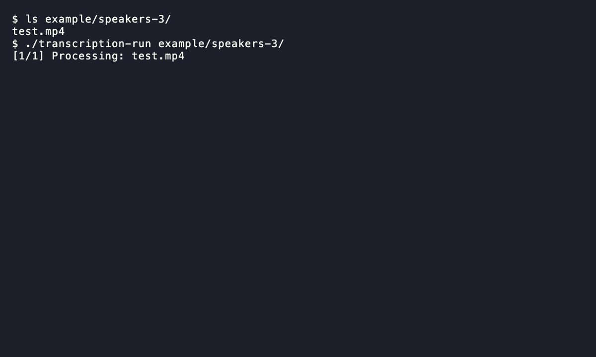

<div align="center">

# 🎬 Transcription CLI

**Batch video transcription to Markdown — fast, concurrent, and fully offline.**

**🇬🇧 English** · [🇺🇦 Українська](#-transcription-cli--українська)

[](https://go.dev/dl/)
[](#installation)
[](#-about)
[](https://github.com/ggml-org/whisper.cpp)


</div>

---

## 📖 About

**Transcription CLI** is a command-line tool for **batch** transcription of video files.
Point it at a folder of videos — it processes all videos in that folder (top level only,
nested folders are skipped), extracts audio with `ffmpeg`, recognizes speech with `whisper.cpp`,
and **combines the transcripts into a single Markdown file** with a separate `## video-name`
section for each video (very large results are split into `-chunk2.md`, `-chunk3.md`, etc.).

- 🚀 **Concurrent processing** — several videos at a time (4 by default, configurable), with live progress in the console.
- 🔒 **Fully private** — everything runs locally on your machine. **No files, audio, or
  text are ever sent anywhere.** The internet is needed only to install dependencies and
  download models — the transcription itself runs fully offline.
- 🌍 **Multilingual** — Ukrainian, English, Russian, and dozens of other languages,
  or auto-detection.
- 📝 **Clean output** — tidy Markdown with a separate section for each video.

### Why not just use whisper.cpp?

`whisper.cpp` transcribes **one** file at a time. This tool adds a practical workflow on top:

- 📁 **Batch processing** — a whole folder of videos at once, not file by file by hand.
- ⚡ **Parallelism** — process several videos at once (ffmpeg + whisper). Defaults to
  4 workers; set fewer or more via `MAX_WORKERS` in the config — as many as your machine can handle.
- 📊 **Live progress** — you see what's processing, what's done, and what failed.
- 📝 **Ready-to-use Markdown** — one `.md` with a section per video: sorted, word-wrapped, with
  automatic splitting of oversized files (instead of a raw pile of `.txt` files).
- 📦 **Simple binaries** — download one for your OS and run it; no need to install Go.

Below is a short step-by-step guide "from `git clone` to running" for each OS.

---

## System requirements

- **OS:** macOS 13+ (Apple Silicon or Intel), Linux x86-64 or ARM64, Windows 10/11 (64-bit).
- **CPU:** 64-bit, 4+ cores (recognition uses all cores; the more, the faster).
- **RAM (recommended, whole system):** the values account for the model, the OS, temporary
  audio files, and processing several videos in parallel:

  | Model      | Recommended RAM | Comfortable |
  |------------|-----------------|-------------|
  | `tiny`     | 2 GB            | 4 GB        |
  | `small`    | 4 GB            | 6 GB        |
  | `medium`   | 6 GB            | 8 GB        |
  | `large-v3` | 8 GB            | 16 GB       |

- **Disk:** ~1 GB for the project + tools, plus space for the model file
  (up to ~3 GB for `large-v3`) and temporary `.wav` files (audio is extracted before recognition).
- **GPU (optional):** speeds up recognition but is not required — it works on CPU.
  Metal (Apple Silicon), CUDA (NVIDIA), or Vulkan is used **only if whisper.cpp was built with
  the corresponding backend** (the default build is CPU).
- **Internet:** only for installing dependencies and downloading the model;
  the recognition itself works offline.

> Speed depends on your CPU, GPU, the chosen model, and how many tasks run at once.
> To gauge performance on your own machine, run the bundled 60-second video from the
> `example/speakers-3/` folder (see "Try the bundled sample").

---

## Installation

Two ways to get the binary. Both need **ffmpeg** and **whisper-cli** in your `PATH` and a model in `models/`; **Go is only needed for Option B**. The `.env` file is optional — the binary does not embed it and runs with defaults (`prod`, auto language, `medium` model) without it.

### Option A — Prebuilt binary (no Go)

Download your file from the [releases page](https://github.com/nrnwest/transcription/releases/latest): `transcription-run-darwin-arm64` (Apple Silicon) / `-darwin-amd64` (Intel) / `-linux-amd64` / `-linux-arm64` / `-windows-amd64.exe`. Checksums are in `SHA256SUMS.txt`.

#### macOS

```bash
# 1. Dependencies (no Go)
brew install ffmpeg whisper-cpp

# 2. Model
mkdir -p models
curl -L -o models/ggml-medium.bin https://huggingface.co/ggerganov/whisper.cpp/resolve/main/ggml-medium.bin

# 3. Make the downloaded binary executable and run (Intel: -darwin-amd64)
chmod +x transcription-run-darwin-arm64
./transcription-run-darwin-arm64 /path/to/videos/
```

> If macOS blocks it: `xattr -d com.apple.quarantine ./transcription-run-darwin-arm64`

#### Linux (Debian/Ubuntu)

```bash
# 1. Dependencies (no Go): ffmpeg from apt, whisper-cli from source
sudo apt install ffmpeg git cmake build-essential
git clone https://github.com/ggml-org/whisper.cpp
cd whisper.cpp && cmake -B build && cmake --build build -j
sudo cp build/bin/whisper-cli /usr/local/bin/ && cd ..

# 2. Model
mkdir -p models
curl -L -o models/ggml-medium.bin https://huggingface.co/ggerganov/whisper.cpp/resolve/main/ggml-medium.bin

# 3. Make the downloaded binary executable and run (ARM64: -linux-arm64)
chmod +x transcription-run-linux-amd64
./transcription-run-linux-amd64 /path/to/videos/
```

#### Windows (PowerShell)

```powershell
# 1. Dependencies (no Go): ffmpeg from winget, whisper-cli from the whisper.cpp archive
winget install --id Gyan.FFmpeg --exact
# Download the Windows archive from https://github.com/ggml-org/whisper.cpp/releases,
# unpack it, and add the folder with whisper-cli.exe to PATH.

# 2. Model
New-Item -ItemType Directory -Force models | Out-Null
curl.exe -L -o models/ggml-medium.bin https://huggingface.co/ggerganov/whisper.cpp/resolve/main/ggml-medium.bin

# 3. Run
.\transcription-run-windows-amd64.exe C:\path\to\videos\
```

### Option B — Build from source (needs Go)

#### macOS

```bash
# 1. Dependencies incl. Go
brew install go ffmpeg whisper-cpp

# 2. Clone and build
git clone https://github.com/nrnwest/transcription.git
cd transcription
cp .env.example .env    # optional
make build

# 3. Model
mkdir -p models
curl -L -o models/ggml-medium.bin https://huggingface.co/ggerganov/whisper.cpp/resolve/main/ggml-medium.bin

# 4. Run
./transcription-run /path/to/videos/
```

> If `whisper-cpp` doesn't provide `whisper-cli`, build whisper.cpp from source (see Linux).

#### Linux (Debian/Ubuntu)

```bash
# 1. System deps + Go ≥ 1.26.1 (install Go from go.dev/dl — the apt version is outdated)
sudo apt install ffmpeg git cmake build-essential

# 2. whisper-cli from source (CPU build; for GPU add -DGGML_CUDA=1 or -DGGML_VULKAN=1)
git clone https://github.com/ggml-org/whisper.cpp
cd whisper.cpp && cmake -B build && cmake --build build -j
sudo cp build/bin/whisper-cli /usr/local/bin/ && cd ..

# 3. Clone and build the project
git clone https://github.com/nrnwest/transcription.git
cd transcription
cp .env.example .env    # optional
make build

# 4. Model
mkdir -p models
curl -L -o models/ggml-medium.bin https://huggingface.co/ggerganov/whisper.cpp/resolve/main/ggml-medium.bin

# 5. Run
./transcription-run /path/to/videos/
```

#### Windows (PowerShell)

```powershell
# 1. ffmpeg + Go ≥ 1.26.1 (install Go from https://go.dev/dl/)
winget install --id Gyan.FFmpeg --exact

# 2. whisper-cli: download the Windows archive from
#    https://github.com/ggml-org/whisper.cpp/releases, unpack it, add its folder to PATH.

# 3. Clone and build
git clone https://github.com/nrnwest/transcription.git
cd transcription
Copy-Item .env.example .env    # optional
go build -o transcription-run.exe .\cmd\transcription\

# 4. Model
New-Item -ItemType Directory -Force models | Out-Null
curl.exe -L -o models/ggml-medium.bin https://huggingface.co/ggerganov/whisper.cpp/resolve/main/ggml-medium.bin

# 5. Run
.\transcription-run.exe C:\path\to\videos\
```

> Language is optional — auto-detected by default. To force one: `-lang en` (e.g. `./transcription-run -lang en /path/to/videos/`).

---

## Next steps

- **Language:** **optional** — by default the video language is auto-detected
  (`WHISPER_LANG=auto` in `.env`). To force a specific one, add the flag:
  `-lang en` (English), `uk`, `ru`, etc., e.g. `./transcription-run -lang en /videos/`.
- **Where the result goes:** a `.md` file next to the videos. A different folder — as a
  second argument: `./transcription-run -lang en /videos/ /output/`.
- **Model:** the `.env` line `WHISPER_MODEL=medium` (`tiny` / `small` /
  `medium` / `large-v3`). The model file must live in the `models/` folder.

| Model      | File                | Size    |
|------------|---------------------|---------|
| `tiny`     | `ggml-tiny.bin`     | ~75 MB  |
| `small`    | `ggml-small.bin`    | ~466 MB |
| `medium`   | `ggml-medium.bin`   | ~1.5 GB |
| `large-v3` | `ggml-large-v3.bin` | ~2.9 GB |

To use a different model — replace `medium` with the desired name in the download command.

**Supported formats (video & audio):**
- Video: `.mkv`, `.mp4`, `.avi`, `.webm`, `.mov`
- Audio (including phone/dictaphone recordings): `.mp3`, `.m4a`, `.aac`, `.wav`, `.flac`, `.ogg`, `.opus`, `.wma`, `.amr`, `.aiff`, `.aif`, `.3gp`, `.caf`

**`.env` settings (optional):** `MODE` (`dev`/`prod`), `LOG_PATH`, `OUTPUT_DIR`, `WHISPER_MODEL`,
`WHISPER_LANG`, `WHISPER_NO_GPU`, `MAX_WORKERS` (parallel files, default 4), `DIARIZE`,
`DIARIZE_SPEAKERS`, `DIARIZE_THRESHOLD`, `DIARIZE_LABEL` (speaker diarization, see below). Copy `.env.example`
to `.env` and edit as needed.

## Speaker diarization (optional)

The tool can label who is speaking — paragraphs come out as `**speaker-1:** …`, `**speaker-2:** …`
(the label is configurable via `DIARIZE_LABEL`, e.g. `Speaker`). This uses the offline
[sherpa-onnx](https://github.com/k2-fsa/sherpa-onnx) speaker-diarization CLI and works for any
language. It's fully optional: without it the program behaves exactly as before.

1. **Install the sherpa-onnx binary.** Download the archive for your platform from the
   [sherpa-onnx releases](https://github.com/k2-fsa/sherpa-onnx/releases) and put
   `sherpa-onnx-offline-speaker-diarization` into your `PATH`.
2. **The two ONNX models are already in the repo** — `models/diarization/segmentation.onnx`
   and `models/diarization/embedding.onnx` (~33 MB total, MIT / Apache-2.0 — see `NOTICE.md`
   there). Nothing to download after cloning.

   <details>
   <summary>Using a prebuilt binary without cloning? Download them yourself</summary>

   ```bash
   mkdir -p models/diarization
   # Segmentation model (pyannote segmentation 3.0):
   curl -L https://github.com/k2-fsa/sherpa-onnx/releases/download/speaker-segmentation-models/sherpa-onnx-pyannote-segmentation-3-0.tar.bz2 | tar xj
   mv sherpa-onnx-pyannote-segmentation-3-0/model.onnx models/diarization/segmentation.onnx
   # Speaker embedding model (campplus zh+en — the best general-purpose pick in our tests):
   curl -L -o models/diarization/embedding.onnx https://github.com/k2-fsa/sherpa-onnx/releases/download/speaker-recongition-models/3dspeaker_speech_campplus_sv_zh_en_16k-common_advanced.onnx
   ```

   Any other embedding model from the
   [speaker-recognition list](https://github.com/k2-fsa/sherpa-onnx/releases/tag/speaker-recongition-models)
   works too — just save it as `embedding.onnx`.
   </details>

3. **Run with `-diarize`** (optionally hint the number of speakers with `-speakers N`,
   or tune voice splitting with `-threshold X`):

   ```bash
   ./transcription-run -diarize -speakers 2 /videos/
   # or: let sherpa auto-detect speakers, splitting voices more aggressively
   ./transcription-run -diarize -threshold 0.3 /videos/
   ```

Notes:

- If diarization fails for a file (or finds no speakers), the plain transcript is written
  instead — a warning is printed, the file is not treated as failed.
- Diarization quality depends on the embedding model and audio quality; overlapping speech
  is hard for any diarizer.
- If voices get merged into one speaker, lower the clustering threshold: `-threshold 0.3`
  (or `DIARIZE_THRESHOLD=0.3`). It applies only when the speaker count is auto-detected
  (`-speakers` not set); lower = more speakers.
- `DIARIZE=true` in `.env` enables it permanently; the `-diarize` flag enables it per run.

### Higher quality: the pyannote engine (optional)

For noticeably better speaker separation the tool can use
[pyannote 3.1](https://huggingface.co/pyannote/speaker-diarization-3.1) instead of sherpa-onnx.
It also runs **fully offline** — a HuggingFace token is needed only once, to download the model
weights. The trade-off: it requires Python with PyTorch (~2–3 GB of dependencies) and is slower.

1. **Install pyannote.audio** (a virtualenv is recommended):

   ```bash
   python3 -m venv ~/.venv/pyannote
   ~/.venv/pyannote/bin/pip install pyannote.audio
   ```

2. **Models are already in the repo.** The pipeline weights live in
   `models/diarization-pyannote/` (~31 MB, redistributed under CC-BY-4.0 — see
   `NOTICE.md` there), so after cloning the repo **no HuggingFace account, token, or
   network is needed** — everything runs fully offline out of the box.

   <details>
   <summary>Alternative: download from HuggingFace yourself</summary>

   If `models/diarization-pyannote/` is absent, the tool falls back to the HuggingFace hub.
   The pyannote models are gated: log in on huggingface.co and accept the user conditions
   on **all three** pages (each is a separate "Agree" click):

   - [pyannote/speaker-diarization-community-1](https://huggingface.co/pyannote/speaker-diarization-community-1) —
     the pipeline used by pyannote.audio 4.x;
   - [pyannote/speaker-diarization-3.1](https://huggingface.co/pyannote/speaker-diarization-3.1) — the 3.x fallback;
   - [pyannote/segmentation-3.0](https://huggingface.co/pyannote/segmentation-3.0) — pulled in by 3.1.

   Then create an [access token](https://huggingface.co/settings/tokens) (read scope is enough)
   and run the first transcription with `HF_TOKEN` set — the weights are cached in
   `~/.cache/huggingface` and every later run works offline without the token.

   If you skipped one of the pages, diarization fails with
   `403 ... Cannot access gated repo` naming the missing model — accept its conditions and retry.
   </details>

3. **Run with `-engine pyannote`** (point `DIARIZE_PYTHON` in `.env` at your venv):

   ```bash
   # .env: DIARIZE_PYTHON=~/.venv/pyannote/bin/python3
   ./transcription-run -diarize -engine pyannote example/speakers-2/
   ```

Notes: `-threshold` does not apply to pyannote (its pipeline clusters speakers itself);
`-speakers N` works with both engines. `DIARIZE_ENGINE=pyannote` in `.env` makes it the default.

## Try the bundled sample

The repo ships two ready-made samples — a short video plus the Markdown it produces:

| Folder | Length | Voices |
|---|---|---|
| `example/speakers-3/` | 60 s | 3 speakers |
| `example/speakers-2/` | 30 s | 2 speakers |

After building and downloading a model, try one — **no need to specify the language, it's
auto-detected**:

```bash
./transcription-run example/speakers-3/
```

> Point it at a sample folder, not at `example/` itself — the scan covers only the top level
> of the given folder, and `example/` holds no media directly.



It creates `example/speakers-3/speakers-3.md`:

```markdown
# Transcription: speakers-3

## test

(upbeat music)
Welcome to English in a Minute.
Pie is a delicious dessert,
and there are so many different flavors,
like cherry, lemon, banana cream.
But what could the idiom pie in the sky mean?
...
```

The same file **with speaker diarization** — this is exactly what the bundled `.md` contains:

```bash
./transcription-run -diarize -speakers 3 example/speakers-3/
```

```markdown
# Transcription: speakers-3

## test

**speaker-1:** (upbeat music)

**speaker-2:** Welcome to English in a Minute. Pie is a delicious dessert, and there are so
many different flavors, like cherry, lemon, banana cream. But what could the idiom pie in
the sky mean?

**speaker-3:** Pedro is finally moving to Hollywood to follow his acting dream.
...
```

Since the bundled `.md` files are the diarized results, a plain run overwrites them — restore
with `git checkout example/`, or write elsewhere: `./transcription-run example/speakers-3/ /tmp/out`.

## Example use case

Imagine a long technical video — a lecture, a conference talk, or a tutorial — packed with
useful information that's tedious to rewatch. With this tool the workflow looks like this:

1. **Transcribe the video** — point it at a folder and get clean Markdown text:
   ```bash
   ./transcription-run ~/Downloads/lecture/
   ```
2. **Upload the `.md`** to [Google NotebookLM](https://notebooklm.google.com/) (or any other
   AI/RAG tool — ChatGPT, Claude, Obsidian, etc.) as a source.
3. **Get a knowledge base** for that video: ask questions in natural language, generate a
   summary, a timeline, or key takeaways — and find what you need instantly without scrubbing
   through the footage.

That's how dozens of hours of video turn into structured, searchable material.

## Limitations

- Only files in the given folder are processed — **no recursive scan** of nested folders.
- Accuracy depends on the chosen model and audio quality.
- Parallel processing can noticeably increase RAM usage.
- GPU acceleration depends on how `whisper.cpp` was built.
- Speaker separation requires the optional sherpa-onnx setup (see "Speaker diarization");
  without it the transcript has no speaker labels.

## Troubleshooting

**`ffmpeg not found in PATH`** — make sure `ffmpeg` is installed and available in `PATH`.

**`whisper-cli not found in PATH`** — make sure `whisper-cli` is installed and available in `PATH`.

**Model file not found** — put the model file in a `models/` folder next to the binary or in the project root.

**`diarization: exit status 4` (pyannote engine)** — the pipeline could not load the gated
models. Make sure you accepted the user conditions on **all three** HuggingFace pages listed in
the "pyannote engine" section above, and pass `HF_TOKEN=hf_...` on the first run. The exact
missing model is named in the console output (dev mode shows the full Python error).

**`pyannote.audio is not installed for ...`** — install it into the interpreter set in
`DIARIZE_PYTHON`: `pip install pyannote.audio` (use the venv path from the "pyannote engine"
section).

**Diarization fails with `signal: killed` on macOS** — Gatekeeper kills the downloaded
sherpa-onnx binary. Ad-hoc sign it together with its libraries:

```bash
codesign --force -s - /path/to/sherpa-onnx/lib/*.dylib /path/to/sherpa-onnx/bin/sherpa-onnx-offline-speaker-diarization
```

**macOS blocks the binary** — clear the quarantine attribute:

```bash
xattr -d com.apple.quarantine ./transcription-run-darwin-arm64
```

or allow it in **System Settings → Privacy & Security**.

## License

[MIT](LICENSE) — free to use, including commercially.

---

<div align="center">

# 🎬 Transcription CLI — Українська

**Пакетна транскрибація відео у Markdown — швидко, паралельно й повністю офлайн.**

[🇬🇧 English](#-transcription-cli) · **🇺🇦 Українська**

[](https://go.dev/dl/)
[](#встановлення)
[](#-про-програму)
[](https://github.com/ggml-org/whisper.cpp)

</div>

---

## 📖 Про програму

**Transcription CLI** — консольна утиліта для **пакетної** транскрибації відеофайлів.
Вкажи теку з відео — програма візьме всі відео з цієї теки (лише верхній рівень,
вкладені підпапки пропускаються), витягне аудіо через `ffmpeg`, розпізнає мовлення через
`whisper.cpp` і **об'єднає транскрипції в один Markdown-файл** з окремим розділом
`## назва-відео` на кожне відео (дуже великі результати діляться на `-chunk2.md`,
`-chunk3.md` тощо).

- 🚀 **Паралельна обробка** — кілька відео одночасно (дефолт 4, налаштовується), з живим прогресом у консолі.
- 🔒 **Повна приватність** — усе працює локально на твоєму компʼютері. **Жодні
  файли, аудіо чи текст нікуди не передаються.** Інтернет потрібен лише для встановлення
  залежностей і завантаження моделей — сама транскрибація виконується повністю офлайн.
- 🌍 **Багатомовність** — українська, англійська, російська та десятки інших мов,
  або автовизначення.
- 📝 **Зручний вивід** — акуратний Markdown з окремим розділом на кожне відео.

### Навіщо це, якщо є whisper.cpp?

`whisper.cpp` розпізнає **один** файл за раз. Цей застосунок додає зверху практичний робочий цикл:

- 📁 **Пакетна обробка** — одразу вся тека відео, а не файл за файлом вручну.
- ⚡ **Паралельність** — кілька відео одночасно (ffmpeg + whisper). За замовчуванням
  4 потоки; через `MAX_WORKERS` у конфізі можна задати менше або більше — скільки витягне ваш комп'ютер.
- 📊 **Живий прогрес** — видно, що обробляється, що готове, а що впало.
- 📝 **Готовий Markdown** — один `.md` з розділом на кожне відео: відсортований, з перенесенням
  рядків і авто-розбиттям надто великих файлів (а не «сира» купа `.txt`).
- 📦 **Прості бінарники** — скачав під свою ОС і запустив; Go ставити не треба.

Нижче — коротка покрокова інструкція «від `git clone` до запуску» під кожну ОС.

---

## Системні вимоги

- **ОС:** macOS 13+ (Apple Silicon або Intel), Linux x86-64 або ARM64, Windows 10/11 (64-bit).
- **CPU:** 64-bit, від 4 ядер (розпізнавання використовує всі ядра; що більше — то швидше).
- **RAM (рекомендовано для системи):** значення враховують модель, ОС, тимчасові аудіофайли
  та паралельну обробку кількох відео:

  | Модель     | Рекомендовано RAM | Комфортно |
  |------------|-------------------|-----------|
  | `tiny`     | 2 GB              | 4 GB      |
  | `small`    | 4 GB              | 6 GB      |
  | `medium`   | 6 GB              | 8 GB      |
  | `large-v3` | 8 GB              | 16 GB     |

- **Диск:** ~1 GB на проєкт + інструменти, плюс місце під файл моделі
  (до ~3 GB для `large-v3`) і тимчасові `.wav` (аудіо витягується перед розпізнаванням).
- **GPU (необовʼязково):** прискорює розпізнавання, але не потрібен — на CPU працює.
  Metal (Apple Silicon), CUDA (NVIDIA) чи Vulkan — **лише якщо whisper.cpp зібрано з
  відповідним бекендом** (стандартна збірка — CPU).
- **Інтернет:** лише для встановлення залежностей і завантаження моделі;
  саме розпізнавання працює офлайн.

> Швидкість залежить від CPU, GPU, вибраної моделі та кількості одночасних задач.
> Щоб оцінити продуктивність саме на своїй машині — запусти готове 60-секундне відео
> з теки `example/speakers-3/` (див. розділ «Спробувати на готовому прикладі»).

---

## Встановлення

Два способи отримати бінарник. Обидва потребують **ffmpeg** і **whisper-cli** у `PATH` та модель у `models/`; **Go потрібен лише для Варіанта Б**. Файл `.env` необовʼязковий — бінарник не містить його в собі й без нього працює з дефолтами (`prod`, автовизначення мови, модель `medium`).

### Варіант A — Готовий бінарник (без Go)

Завантаж свій файл зі [сторінки релізів](https://github.com/nrnwest/transcription/releases/latest): `transcription-run-darwin-arm64` (Apple Silicon) / `-darwin-amd64` (Intel) / `-linux-amd64` / `-linux-arm64` / `-windows-amd64.exe`. Контрольні суми — у `SHA256SUMS.txt`.

#### macOS

```bash
# 1. Залежності (без Go)
brew install ffmpeg whisper-cpp

# 2. Модель
mkdir -p models
curl -L -o models/ggml-medium.bin https://huggingface.co/ggerganov/whisper.cpp/resolve/main/ggml-medium.bin

# 3. Зроби завантажений бінарник виконуваним і запусти (Intel: -darwin-amd64)
chmod +x transcription-run-darwin-arm64
./transcription-run-darwin-arm64 /шлях/до/відео/
```

> Якщо macOS блокує: `xattr -d com.apple.quarantine ./transcription-run-darwin-arm64`

#### Linux (Debian/Ubuntu)

```bash
# 1. Залежності (без Go): ffmpeg з apt, whisper-cli з сирців
sudo apt install ffmpeg git cmake build-essential
git clone https://github.com/ggml-org/whisper.cpp
cd whisper.cpp && cmake -B build && cmake --build build -j
sudo cp build/bin/whisper-cli /usr/local/bin/ && cd ..

# 2. Модель
mkdir -p models
curl -L -o models/ggml-medium.bin https://huggingface.co/ggerganov/whisper.cpp/resolve/main/ggml-medium.bin

# 3. Зроби бінарник виконуваним і запусти (ARM64: -linux-arm64)
chmod +x transcription-run-linux-amd64
./transcription-run-linux-amd64 /шлях/до/відео/
```

#### Windows (PowerShell)

```powershell
# 1. Залежності (без Go): ffmpeg з winget, whisper-cli з архіву whisper.cpp
winget install --id Gyan.FFmpeg --exact
# Завантаж Windows-архів зі https://github.com/ggml-org/whisper.cpp/releases,
# розпакуй і додай теку з whisper-cli.exe до PATH.

# 2. Модель
New-Item -ItemType Directory -Force models | Out-Null
curl.exe -L -o models/ggml-medium.bin https://huggingface.co/ggerganov/whisper.cpp/resolve/main/ggml-medium.bin

# 3. Запуск
.\transcription-run-windows-amd64.exe C:\шлях\до\відео\
```

### Варіант Б — Збірка з коду (потрібен Go)

#### macOS

```bash
# 1. Залежності разом із Go
brew install go ffmpeg whisper-cpp

# 2. Клонувати й зібрати
git clone https://github.com/nrnwest/transcription.git
cd transcription
cp .env.example .env    # необовʼязково
make build

# 3. Модель
mkdir -p models
curl -L -o models/ggml-medium.bin https://huggingface.co/ggerganov/whisper.cpp/resolve/main/ggml-medium.bin

# 4. Запуск
./transcription-run /шлях/до/відео/
```

> Якщо `whisper-cpp` не дає команди `whisper-cli` — збери whisper.cpp з сирців (як у Linux).

#### Linux (Debian/Ubuntu)

```bash
# 1. Системні залежності + Go ≥ 1.26.1 (Go — з go.dev/dl, apt-версія застаріла)
sudo apt install ffmpeg git cmake build-essential

# 2. whisper-cli з сирців (CPU-збірка; для GPU додай -DGGML_CUDA=1 або -DGGML_VULKAN=1)
git clone https://github.com/ggml-org/whisper.cpp
cd whisper.cpp && cmake -B build && cmake --build build -j
sudo cp build/bin/whisper-cli /usr/local/bin/ && cd ..

# 3. Клонувати й зібрати проєкт
git clone https://github.com/nrnwest/transcription.git
cd transcription
cp .env.example .env    # необовʼязково
make build

# 4. Модель
mkdir -p models
curl -L -o models/ggml-medium.bin https://huggingface.co/ggerganov/whisper.cpp/resolve/main/ggml-medium.bin

# 5. Запуск
./transcription-run /шлях/до/відео/
```

#### Windows (PowerShell)

```powershell
# 1. ffmpeg + Go ≥ 1.26.1 (Go — з https://go.dev/dl/)
winget install --id Gyan.FFmpeg --exact

# 2. whisper-cli: завантаж Windows-архів зі
#    https://github.com/ggml-org/whisper.cpp/releases, розпакуй, додай теку до PATH.

# 3. Клонувати й зібрати
git clone https://github.com/nrnwest/transcription.git
cd transcription
Copy-Item .env.example .env    # необовʼязково
go build -o transcription-run.exe .\cmd\transcription\

# 4. Модель
New-Item -ItemType Directory -Force models | Out-Null
curl.exe -L -o models/ggml-medium.bin https://huggingface.co/ggerganov/whisper.cpp/resolve/main/ggml-medium.bin

# 5. Запуск
.\transcription-run.exe C:\шлях\до\відео\
```

> Мову вказувати необовʼязково — типово визначається автоматично. Щоб зафіксувати: `-lang uk` (напр. `./transcription-run -lang uk /відео/`).

---

## Далі

- **Мова:** вказувати **необовʼязково** — за замовчуванням мова відео визначається
  автоматично (`WHISPER_LANG=auto` у `.env`). Щоб зафіксувати конкретну, додай прапорець:
  `-lang uk` (українська), `ru`, `en` тощо, напр. `./transcription-run -lang uk /відео/`.
- **Куди пишеться результат:** `.md` поряд з відео. Інша тека — другим
  аргументом: `./transcription-run -lang uk /відео/ /вивід/`.
- **Модель:** у `.env` рядок `WHISPER_MODEL=medium` (`tiny` / `small` /
  `medium` / `large-v3`). Файл моделі має лежати у теці `models/`.

| Модель     | Файл                | Розмір  |
|------------|---------------------|---------|
| `tiny`     | `ggml-tiny.bin`     | ~75 MB  |
| `small`    | `ggml-small.bin`    | ~466 MB |
| `medium`   | `ggml-medium.bin`   | ~1.5 GB |
| `large-v3` | `ggml-large-v3.bin` | ~2.9 GB |

Щоб узяти іншу модель — у команді завантаження заміни `medium` на потрібну назву.

**Підтримувані формати (відео та аудіо):**
- Відео: `.mkv`, `.mp4`, `.avi`, `.webm`, `.mov`
- Аудіо (зокрема диктофонні/телефонні записи): `.mp3`, `.m4a`, `.aac`, `.wav`, `.flac`, `.ogg`, `.opus`, `.wma`, `.amr`, `.aiff`, `.aif`, `.3gp`, `.caf`

**Налаштування `.env` (необовʼязково):** `MODE` (`dev`/`prod`), `LOG_PATH`, `OUTPUT_DIR`, `WHISPER_MODEL`,
`WHISPER_LANG`, `WHISPER_NO_GPU`, `MAX_WORKERS` (паралельні файли, дефолт 4), `DIARIZE`,
`DIARIZE_SPEAKERS`, `DIARIZE_THRESHOLD`, `DIARIZE_LABEL` (розмітка спікерів, див. нижче). Скопіюй `.env.example`
у `.env` і за потреби відредагуй.

## Розмітка спікерів (діаризація, опційно)

Програма вміє позначати, хто говорить: абзаци виходять як `**speaker-1:** …`, `**speaker-2:** …`
(мітку можна змінити через `DIARIZE_LABEL`, напр. `Speaker`). Використовується офлайн-CLI
[sherpa-onnx](https://github.com/k2-fsa/sherpa-onnx), працює для будь-якої мови. Фіча повністю
опційна: без неї програма поводиться точно як раніше.

1. **Встанови бінарник sherpa-onnx.** Завантаж архів для своєї платформи з
   [релізів sherpa-onnx](https://github.com/k2-fsa/sherpa-onnx/releases) і поклади
   `sherpa-onnx-offline-speaker-diarization` у `PATH`.
2. **Дві ONNX-моделі вже в репозиторії** — `models/diarization/segmentation.onnx` і
   `models/diarization/embedding.onnx` (~33 МБ разом, ліцензії MIT / Apache-2.0 — див.
   `NOTICE.md` там само). Після клонування нічого завантажувати не треба.

   <details>
   <summary>Користуєшся готовим бінарником без клонування? Завантаж їх сам</summary>

   ```bash
   mkdir -p models/diarization
   # Модель сегментації (pyannote segmentation 3.0):
   curl -L https://github.com/k2-fsa/sherpa-onnx/releases/download/speaker-segmentation-models/sherpa-onnx-pyannote-segmentation-3-0.tar.bz2 | tar xj
   mv sherpa-onnx-pyannote-segmentation-3-0/model.onnx models/diarization/segmentation.onnx
   # Модель ембедінгів голосу (campplus zh+en — найкращий універсальний вибір у наших тестах):
   curl -L -o models/diarization/embedding.onnx https://github.com/k2-fsa/sherpa-onnx/releases/download/speaker-recongition-models/3dspeaker_speech_campplus_sv_zh_en_16k-common_advanced.onnx
   ```

   Підійде й будь-яка інша модель ембедінгів зі
   [списку speaker-recognition](https://github.com/k2-fsa/sherpa-onnx/releases/tag/speaker-recongition-models) —
   просто збережи її як `embedding.onnx`.
   </details>

3. **Запускай з `-diarize`** (кількість спікерів можна підказати через `-speakers N`,
   а агресивність розділення голосів — через `-threshold X`):

   ```bash
   ./transcription-run -diarize -speakers 2 /videos/
   # або: автовизначення кількості спікерів з агресивнішим розділенням голосів
   ./transcription-run -diarize -threshold 0.3 /videos/
   ```

Нюанси:

- Якщо діаризація для файлу не вдалася (або спікерів не знайдено) — пишеться звичайний
  транскрипт: виводиться попередження, файл не вважається помилковим.
- Якість розмітки залежить від моделі ембедінгів і якості аудіо; накладання голосів —
  складний випадок для будь-якого діаризатора.
- Якщо голоси зливаються в одного спікера — зменш поріг кластеризації: `-threshold 0.3`
  (або `DIARIZE_THRESHOLD=0.3`). Діє лише при автовизначенні кількості спікерів
  (без `-speakers`); менше значення = більше спікерів.
- `DIARIZE=true` у `.env` вмикає фічу назавжди; прапорець `-diarize` — на один запуск.

### Вища якість: двигун pyannote (опційно)

Для помітно кращого розділення спікерів замість sherpa-onnx можна використати
[pyannote 3.1](https://huggingface.co/pyannote/speaker-diarization-3.1). Він теж працює
**повністю офлайн** — HuggingFace-токен потрібен лише один раз, для завантаження ваг моделі.
Ціна: потрібен Python з PyTorch (~2–3 ГБ залежностей), і працює повільніше.

1. **Встанови pyannote.audio** (рекомендовано у virtualenv):

   ```bash
   python3 -m venv ~/.venv/pyannote
   ~/.venv/pyannote/bin/pip install pyannote.audio
   ```

2. **Моделі вже в репозиторії.** Ваги пайплайна лежать у `models/diarization-pyannote/`
   (~31 МБ, розповсюджуються за ліцензією CC-BY-4.0 — див. `NOTICE.md` там само), тож після
   клонування репозиторію **не потрібні ні акаунт HuggingFace, ні токен, ні інтернет** —
   усе працює офлайн одразу.

   <details>
   <summary>Альтернатива: завантажити з HuggingFace самостійно</summary>

   Якщо теки `models/diarization-pyannote/` немає, програма звертається до HuggingFace.
   Моделі pyannote — gated: залогінься на huggingface.co і прийми умови на **всіх трьох**
   сторінках (на кожній — окрема кнопка «Agree»):

   - [pyannote/speaker-diarization-community-1](https://huggingface.co/pyannote/speaker-diarization-community-1) —
     пайплайн, який використовує pyannote.audio 4.x;
   - [pyannote/speaker-diarization-3.1](https://huggingface.co/pyannote/speaker-diarization-3.1) — фолбек для 3.x;
   - [pyannote/segmentation-3.0](https://huggingface.co/pyannote/segmentation-3.0) — її тягне 3.1.

   Потім створи [access token](https://huggingface.co/settings/tokens) (досить read-доступу)
   і виконай перший запуск із заданим `HF_TOKEN` — ваги закешуються в
   `~/.cache/huggingface`, і всі наступні запуски працюють офлайн без токена.

   Якщо якусь сторінку пропустити — діаризація впаде з помилкою
   `403 ... Cannot access gated repo` із назвою моделі, якої бракує: прийми її умови і повтори.
   </details>

3. **Запускай з `-engine pyannote`** (вкажи свій venv у `DIARIZE_PYTHON` в `.env`):

   ```bash
   # .env: DIARIZE_PYTHON=~/.venv/pyannote/bin/python3
   ./transcription-run -diarize -engine pyannote example/speakers-2/
   ```

Нюанси: `-threshold` для pyannote не діє (його пайплайн кластеризує сам);
`-speakers N` працює з обома двигунами. `DIARIZE_ENGINE=pyannote` у `.env` робить його дефолтним.

## Спробувати на готовому прикладі

У репозиторії є два готові приклади — коротке відео разом із Markdown, який воно дає:

| Тека | Тривалість | Голоси |
|---|---|---|
| `example/speakers-3/` | 60 с | 3 спікери |
| `example/speakers-2/` | 30 с | 2 спікери |

Після збірки та завантаження моделі перевір роботу однією командою — **мову вказувати не
треба, вона визначається автоматично**:

```bash
./transcription-run example/speakers-3/
```

> Вказуй саме теку прикладу, а не `example/` — скан охоплює лише верхній рівень заданої теки,
> а в самому `example/` медіафайлів немає.


Програма створить `example/speakers-3/speakers-3.md`:

```markdown
# Transcription: speakers-3

## test

(upbeat music)
Welcome to English in a Minute.
Pie is a delicious dessert,
and there are so many different flavors,
like cherry, lemon, banana cream.
But what could the idiom pie in the sky mean?
...
```

Той самий файл **із розміткою спікерів** — саме це й лежить у готовому `.md`:

```bash
./transcription-run -diarize -speakers 3 example/speakers-3/
```

```markdown
# Transcription: speakers-3

## test

**speaker-1:** (upbeat music)

**speaker-2:** Welcome to English in a Minute. Pie is a delicious dessert, and there are so
many different flavors, like cherry, lemon, banana cream. But what could the idiom pie in
the sky mean?

**speaker-3:** Pedro is finally moving to Hollywood to follow his acting dream.
...
```

Готові `.md` — це діаризовані результати, тож звичайний прогін їх перезапише: віднови через
`git checkout example/` або пиши в іншу теку: `./transcription-run example/speakers-3/ /tmp/out`.

## Приклад використання

Уяви довге технічне відео — лекцію, доповідь із конференції чи туторіал — де багато
корисної інформації, але передивлятися його щоразу незручно. З цим застосунком робочий
цикл такий:

1. **Транскрибуєш відео** — вказуєш теку, на виході отримуєш чистий Markdown із текстом:
   ```bash
   ./transcription-run ~/Downloads/лекція/
   ```
2. **Завантажуєш `.md`** у [Google NotebookLM](https://notebooklm.google.com/) (або будь-який
   інший AI/RAG-інструмент — ChatGPT, Claude, Obsidian тощо) як джерело.
3. **Отримуєш базу знань** по цьому відео: ставиш питання своєю мовою, генеруєш конспект,
   таймлайн чи список ключових тез — і миттєво знаходиш потрібне, не переглядаючи відео.

Так десятки годин відео перетворюються на структурований матеріал, доступний для пошуку.

## Обмеження

- Обробляються лише файли у вказаній теці — **без рекурсивного обходу** вкладених тек.
- Точність залежить від вибраної моделі та якості аудіо.
- Паралельна обробка може помітно збільшити споживання RAM.
- GPU-прискорення залежить від того, як зібрано `whisper.cpp`.
- Розділення спікерів потребує опційного встановлення sherpa-onnx (див. «Розмітка спікерів»);
  без нього транскрипт іде без міток спікерів.

## Troubleshooting

Повідомлення програми — англійською (вивід уніфіковано).

**`ffmpeg not found in PATH`** — переконайся, що `ffmpeg` встановлено й доступний у `PATH`.

**`whisper-cli not found in PATH`** — переконайся, що `whisper-cli` встановлено й доступний у `PATH`.

**`model ... not found`** — поклади файл моделі в теку `models/` поряд із бінарником або в корені проєкту.

**Діаризація падає з `signal: killed` на macOS** — Gatekeeper вбиває завантажений
бінарник sherpa-onnx. Підпиши його ad-hoc разом із бібліотеками:

```bash
codesign --force -s - /шлях/до/sherpa-onnx/lib/*.dylib /шлях/до/sherpa-onnx/bin/sherpa-onnx-offline-speaker-diarization
```

**macOS блокує запуск бінарника** — зніми атрибут карантину:

```bash
xattr -d com.apple.quarantine ./transcription-run-darwin-arm64
```

або дозволь запуск у **System Settings → Privacy & Security**.

## Ліцензія

[MIT](LICENSE) — вільне використання, зокрема комерційне.
